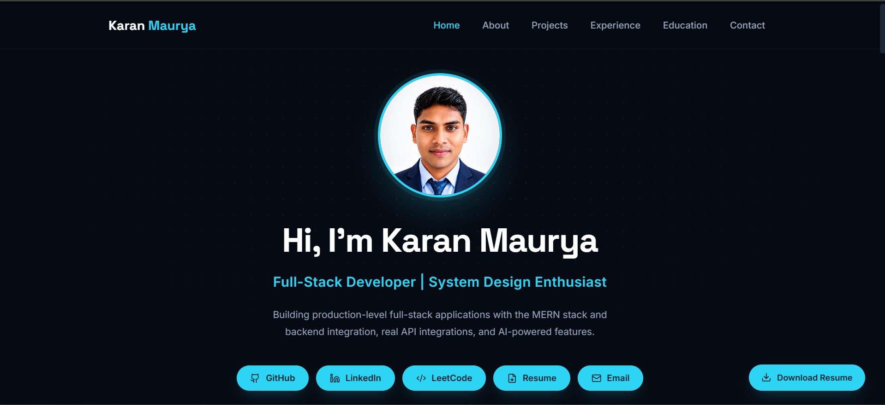

# 👋 Karan Maurya — Portfolio

> A modern, responsive, and production-ready portfolio website built with **React** and **Vite** to showcase my skills, projects, education, experience, and achievements as a Full Stack Developer.

---

## 🌐 Live Demo

[](https://karan-portfolio-mu-murex.vercel.app)
[](https://github.com/karanmaurya-git/karanportfolio)

> A modern, responsive, and production-ready portfolio website built with **React** and **Vite** to showcase my skills, projects, education, experience, and achievements as a Full Stack Developer.

---

## 📸 Portfolio Preview



---

## 📖 About

...

---

## 📸 Portfolio Preview

> Add a screenshot of your portfolio here.


---

## 📖 About

This portfolio represents my journey as a **Full Stack Developer** passionate about building scalable, responsive, and user-friendly web applications using modern web technologies.

The website showcases my technical skills, featured projects, professional experience, education, and resume in a clean and interactive interface with smooth animations and a fully responsive design.

---

## ✨ Features

- Modern Dark UI
- Fully Responsive Design
- React + Vite Architecture
- Smooth Animations
- Technical Skills Showcase
- Featured Projects
- Experience Timeline
- Education Section
- Resume Download
- Contact Section
- Scroll-to-Top Button
- Optimized Performance

---

## 🛠 Tech Stack

### Frontend

- React.js
- Vite
- JavaScript (ES6+)
- HTML5
- CSS3

### Libraries

- Framer Motion
- Lucide React
- React Type Animation

### Tools

- Git
- GitHub
- VS Code
- Vercel

---

## 📂 Folder Structure

```text
karan-portfolio/
│
├── images/
│   └── preview.png
│
├── public/
│   └── Karan_Maurya_Resume.pdf
│
├── src/
│   │
│   ├── assets/
│   │   ├── karan.jpg
│   │   └── projects/
│   │       ├── studyflow.png
│   │       ├── fintrack.png
│   │       └── stacks.png
│   │
│   ├── components/
│   │   ├── Navbar.jsx
│   │   ├── Hero.jsx
│   │   ├── About.jsx
│   │   ├── Projects.jsx
│   │   ├── ProjectCard.jsx
│   │   ├── Experience.jsx
│   │   ├── Education.jsx
│   │   ├── Contact.jsx
│   │   ├── Footer.jsx
│   │   ├── FloatingActions.jsx
│   │   └── *.css
│   │
│   ├── data/
│   │   ├── education.js
│   │   ├── experience.js
│   │   ├── nav.js
│   │   ├── profile.js
│   │   ├── projects.js
│   │   └── skills.js
│   │
│   ├── hooks/
│   │   ├── useActiveSection.js
│   │   └── useReveal.js
│   │
│   ├── styles/
│   │   ├── layout.css
│   │   └── tokens.css
│   │
│   ├── App.jsx
│   └── main.jsx
│
├── package.json
├── vite.config.js
├── README.md
├── .gitignore
└── LICENSE
```

---

## 🚀 Getting Started

```bash
git clone https://github.com/karanmaurya-git/karanportfolio.git

cd karan-portfolio

npm install

npm run dev
```

---

## 📦 Build for Production

```bash
npm run build

npm run preview
```

---

## 🎨 Customization

| Section | File |
|----------|------|
| Profile | `src/data/profile.js` |
| Navigation | `src/data/nav.js` |
| Skills | `src/data/skills.js` |
| Projects | `src/data/projects.js` |
| Experience | `src/data/experience.js` |
| Education | `src/data/education.js` |
| Resume | `public/Karan_Maurya_Resume.pdf` |
| Profile Image | `src/assets/karan.jpg` |

---

## 🚀 Deployment

Deploy the generated `dist/` folder to:

- Vercel
- Netlify
- GitHub Pages
- Firebase Hosting

---

## 📬 Contact

**Karan Maurya**

- 📧 Email: karanmaurya8998@gmail.com
- 💼 LinkedIn: https://linkedin.com/in/karan-maurya-4260b6293/
- 💻 GitHub: https://github.com/karanmaurya-git
- 🌐 Portfolio: https://karan-portfolio-mu-murex.vercel.app

---

## 📄 License

This project is licensed under the **MIT License**. You are free to use this project for learning and inspiration. Attribution is appreciated.

---

## 👨‍💻 Author

**Karan Maurya**

Full Stack Developer passionate about building modern, scalable, and user-centric web applications using the MERN Stack and modern web technologies.